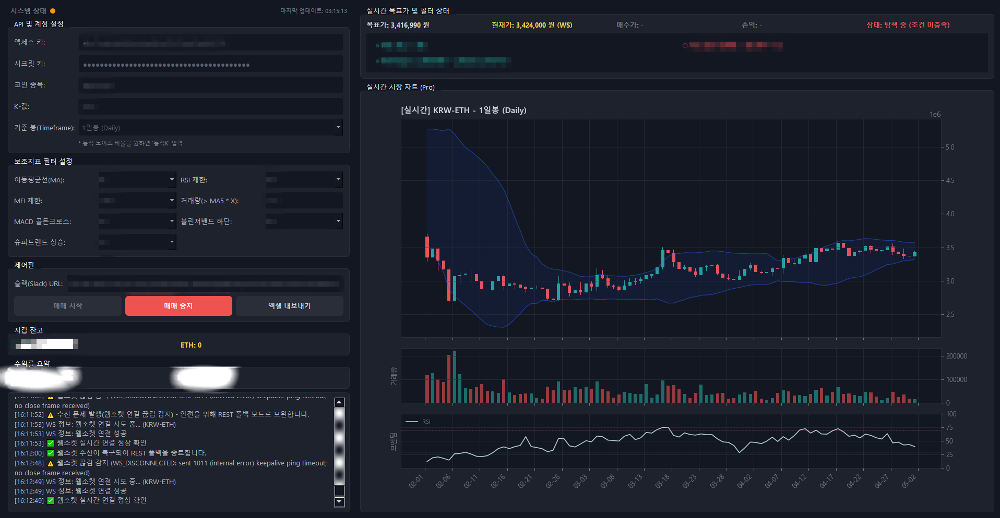

# [업비트] 지표를 조합한 변동성 돌파 전략 자동매매 프로그램

비트코인, 이더리움, 리플을 대상으로 변동성 돌파 전략을 지표와 조합하여 자동매매하는 프로그램입니다.

⚠️충분한 백테스팅 후 진입 필수⚠️ > https://github.com/yoojinsu/Upbit-Backtest

<p align="center">
  
</p>

## 🛠️ 주요 기능


* **실시간 시장 모니터링**
    * *웹소켓 기반 데이터 수신: 업비트 API의 웹소켓을 활용하여 딜레이 없는 실시간 체결 데이터를 수신합니다.*
    * *웹소켓 연결이 끊기거나 프리징 발생 시, 즉각적으로 REST API 폴백 모드로 전환하여 끊기지 않도록 모니터링합니다.*


* **변동성 돌파 전략 및 맞춤형 필터링**
    * *기본전략 : 지정한 기준 타임프레임(1일, 4시간, 1시간)과 K-값(고정값 또는 동적 노이즈 비율)을 기반으로 한 변동성 돌파 전략을 사용합니다.*
      
    * *다중 보조지표 필터 : 시장의 노이즈를 걸러내고 승률을 높이기 위해 아래의 보조지표들을 선택적으로 조합하여 매수 조건을 설정할 수 있습니다.*
       * 이동평균선 (MA): 특정 MA(3, 5, 10, 20, 50, 60) 상향 돌파 시 매수.
       * RSI / MFI: 과매수 구간(예: 70 또는 80 이상) 진입 시 매수 제한. 
       * 거래량 : 예측 거래량이 이전 5봉 평균(MA5) 대비 특정 배율 이상일 때만 매수.
       * MACD: 골든크로스 발생 시 매수.
       * 볼린저 밴드 (Bollinger Bands): 현재가가 하단 밴드 위에 있을 때만 매수.
       * 슈퍼트렌드 (Supertrend): 상승장 트렌드에서만 매수.


      
* **안정적인 매매 실행 및 복구 로직**
    * *비동기 스레드 주문: 시장가 매수/매도 주문을 별도의 백그라운드 스레드에서 비동기로 실행하여 UI 멈춤 현상을 방지합니다.*
    * *추격 매수 방지 : 봇이 재시작되거나 수신 방식이 전환되었을 때, 이미 현재가가 목표가를 크게 상회한 경우 위험한 추격 매수를 차단합니다.*


     
       
* **알림 및 통계 로깅 시스템**
    * *Slack 실시간 알림: 봇 구동 시작, 정기 시스템 리포트, 그리고 매수/매도 체결 시 수익률과 함께 슬랙으로 즉각적인 알림을 전송합니다.*
    * *매매 히스토리 관리: 모든 거래 내역은 trade_history.csv에 기록되며, 누적 수익금과 수익률을 UI에서 요약해서 보여줍니다.*
    * *엑셀 내보내기: 버튼 클릭 한 번으로 거래 내역을 Excel 파일(.xlsx)로 내보낼 수 있으며, 상세 통계(목표가, 실제 매수가, 슬리피지, 낙폭 등)를 daily_trade_stats.xlsx에 자동 저장합니다.*

---

## 📂 파일 구조 

| 파일명 | 역할 및 설명 |
| :--- | :--- |
| **`main.py`** | 프로그램 실행을 담당하는 메인 파일 |
| **`config.py`** | 환경 설정 및 상수 관리 |
| **`api/websocket.py`** | 업비트 거래소와의 실시간 통신을 전담하는 백그라운드 스레드 |
| **`core/strategy.py`** | 전략 및 알고리즘 모듈|
| **`ui/chart.py`** | 시각화 모듈 |

---

## 🚀 실행 방법 (CMD)

아래 순서대로 명령어를 실행해 주세요.
```bash
git clone https://github.com/yoojinsu/Upbit-Autotrade.git

cd Upbit-Autotrade

pip install -r requirements.txt

python main.py
```
---

## 업비트 API 생성
업비트 홈페이지를 참고해주세요. 
https://docs.upbit.com/kr/docs/api-key

---

## Slack URL 생성방법
1. 슬랙 API 페이지(https://api.slack.com/apps)에 접속하여 로그인합니다.
2. 화면 우측 상단의 초록색 [Create New App] 버튼을 클릭하고 [From scratch]를 선택합니다.
3. App Name에 봇 이름(예: 업비트 알리미)을 적고, 알림을 받을 워크스페이스(Workspace)를 선택한 뒤 [Create App]을 클릭합니다.
4. 앱이 생성되면 왼쪽 메뉴 목록에서 [Incoming Webhooks]를 클릭합니다.
5. 화면 우측 상단의 'Activate Incoming Webhooks' 옆에 있는 스위치를 눌러 'On(활성화)' 상태로 변경합니다.
6. 기능이 On으로 바뀌면 화면 아래쪽에 [Add New Webhook to Workspace] 버튼이 나타납니다. 이 버튼을 클릭합니다.
7. 슬랙의 어느 채널로 메시지를 보낼지 묻는 창이 뜹니다. 알림 전용 채널(예: #자동매매-알림)을 선택하고 [허용(Allow)] 버튼을 누릅니다.
8. 허용을 누르고 나면 화면 맨 아래에 Webhook URL이 생성된 것을 볼 수 있습니다.
9. [https://hooks.slack.com/services/](https://hooks.slack.com/services/)... 로 시작하는 이 주소 옆의 [Copy] 버튼을 눌러 복사합니다.

---

##⚠️ 투자 유의사항 및 면책 조항
이 프로그램은 암호화폐 자동매매를 돕기 위해 개인적인 목적으로 개발된 참고용 코드(오픈소스)입니다. 이 프로그램을 다운로드하고 실행함과 동시에 아래의 사항에 동의하는 것으로 간주합니다.

투자 책임의 귀속: 이 프로그램은 어떠한 경우에도 수익을 보장하지 않습니다. 본 프로그램을 사용한 모든 매매의 최종 결정과 그에 따른 투자 손실 및 결과에 대한 법적/도의적 책임은 전적으로 사용자 본인에게 있습니다.

고위험성 안내: 암호화폐(가상자산) 시장은 가격 변동성이 매우 큽니다. 설정된 지표나 K-값, 시장의 갑작스러운 변화에 따라 원금의 일부 또는 전부를 상실할 위험이 존재합니다.

시스템 및 기술적 오류 위험: 사용자의 PC 환경, 네트워크 지연 및 단절, 업비트(Upbit) 거래소 API 서버 점검이나 장애, 혹은 코드 내의 예기치 못한 버그로 인해 의도하지 않은 매매가 발생하거나 적절한 타이밍에 주문이 체결되지 않을 수 있습니다.

과거 데이터의 한계: 과거의 차트 데이터나 알고리즘의 성과가 미래의 수익을 결코 보장하지 않습니다. 실전에 투입하기 전 반드시 소액으로 충분한 테스트를 거치시길 권장합니다.

"투자의 책임은 투자자 본인에게 있습니다. 신중하게 투자하시기 바랍니다."

---
## ✉️ 문의
프로그램 개선 제안이나 사용 관련 문의는 아래 이메일로 연락 부탁드립니다.

Email : jinsu96.yoo@gmail.com

